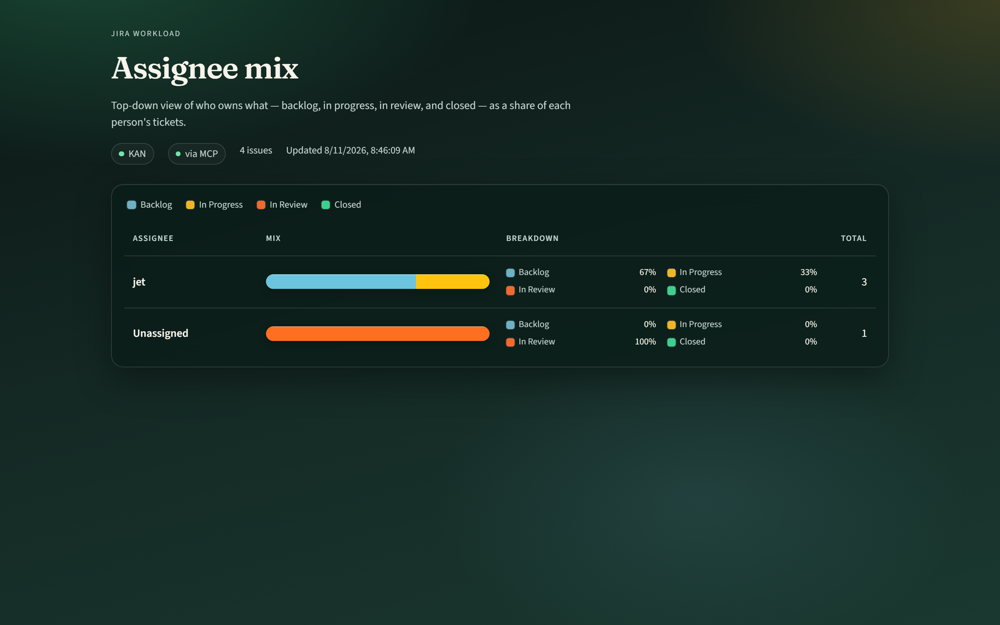
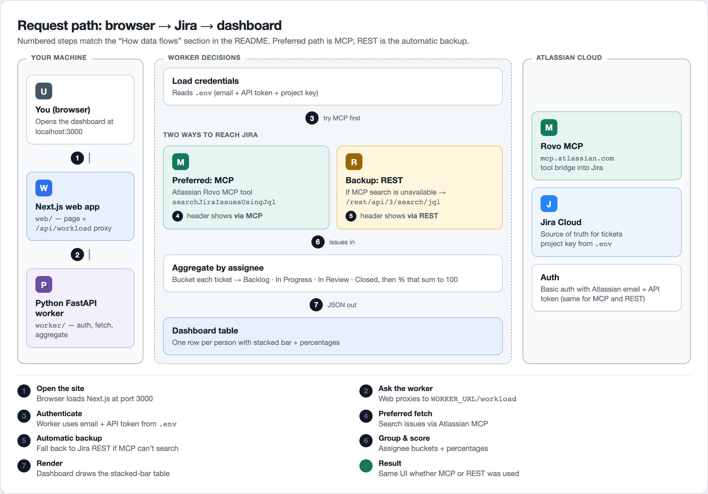

# Jira assignee workload dashboard

A simple web app that shows **who owns which Jira tickets**, grouped by person, with a visual breakdown of:

- **Backlog** (To Do / not started)
- **In Progress**
- **In Review**
- **Closed** (Done)

Each person gets a stacked bar and percentages (always adding up to 100%).

## Dashboard preview

<p align="center">
  
</p>

> Live view of project **KAN**: each assignee’s ticket mix across Backlog, In Progress, In Review, and Closed.

---

## Big picture

Three zones, left → right:

| Zone | What lives there | Simple role |
|------|------------------|-------------|
| **Your machine** | Browser, Next.js (`web/`), Python worker (`worker/`) | UI + local API |
| **Worker decisions** | MCP vs REST, then aggregate | Fetch tickets and do the math |
| **Atlassian Cloud** | Rovo MCP + Jira | Source of truth for tickets |



<p align="center"><em>Same numbered steps as below — MCP is preferred; REST is the automatic backup.</em></p>

---

## How data flows (plain English)

When you open or refresh the dashboard, this is what happens:

1. **Open the site** in the browser (http://localhost:3000).
2. **Ask the worker** — the web app proxies to `WORKER_URL/workload`.
3. **Authenticate** — the worker uses the email + API token from your `.env` file.
4. **Preferred fetch (MCP)** — talk to **Atlassian Rovo MCP** and search tickets in your project (for example `KAN`).
5. **Automatic backup (REST)** — if MCP cannot search, call **Jira’s REST API** instead. Same login, different door.
6. **Group & score** — sort tickets by assignee (`Unassigned` if none), bucket by status, and compute percentages that sum to 100:
   - status contains “review” → **In Review**
   - Done / Closed / Resolved → **Closed**
   - In Progress → **In Progress**
   - otherwise → **Backlog**
7. **Render** — the web app draws one row per person, with a stacked bar and the four percentages.

The header pill **via MCP** means step 4 worked. **via REST** means step 5 was used.

---

## Walkthrough with a real example

Suppose Jira project `KAN` has these tickets:

| Ticket | Status in Jira | Assigned to | Bucket we use |
|--------|----------------|-------------|----------------|
| KAN-1 | To Do | jet | Backlog |
| KAN-5 | To Do | jet | Backlog |
| KAN-2 | In Progress | jet | In Progress |
| KAN-4 | In Review | _(nobody)_ | In Review |

The dashboard shows:

| Person | Total | What you see |
|--------|-------|----------------|
| **jet** | 3 | ~67% Backlog, ~33% In Progress, 0% Review, 0% Closed |
| **Unassigned** | 1 | 100% In Review |

So if **In Review** looks empty for jet, check who owns that ticket on the Jira board — it may be Unassigned.

---

## Project folders

```text
jira_ticketing/
  web/       ← the website (dashboard UI)
  worker/    ← Python FastAPI API that talks to Jira / MCP
  docs/      ← diagrams and docs assets
  .env       ← secrets (email, API token, project key) — never commit this
```

---

## Setup (run it locally)

1. Copy `.env.example` to `.env` and fill in:
   - `JIRA_EMAIL` — your Atlassian login email  
   - `JIRA_API_KEY` — Atlassian API token  
   - `JIRA_SITE` — e.g. `https://your-site.atlassian.net`  
   - `JIRA_PROJECT_KEY` — e.g. `KAN`  
   - `WORKER_PORT` — usually `4000`

2. Start the worker (Terminal 1):

```bash
cd worker
python3.12 -m venv .venv
source .venv/bin/activate
pip install -r requirements.txt
uvicorn app.main:app --host 0.0.0.0 --port 4000 --reload
```

Or from the repo root (after the venv exists): `npm run start:worker`

3. Start the website (Terminal 2):

```bash
cd web
npm install
npm run dev
```

4. Open **http://localhost:3000** in your browser.

> **Tip:** Use Python **3.11+** for the worker. Install and run the web app from the **same** environment (all Windows **or** all WSL) so native packages like `esbuild` work.

Optional for the website: set `WORKER_URL=http://localhost:4000` in `web/.env.local` (this is the default).
---

## Words you might see

| Term | Meaning |
|------|---------|
| **Assignee** | The person who owns the ticket |
| **MCP** | Model Context Protocol — a standard way apps call tools (here: Jira tools hosted by Atlassian) |
| **REST API** | Jira’s normal HTTP interface for reading/writing tickets |
| **cloudId** | Atlassian’s internal ID for your Jira site (needed for MCP Jira calls) |
| **Worker** | Our Python FastAPI backend that fetches and summarizes tickets |

---

## Notes for MCP

- MCP is preferred when your API token can use Jira search tools.
- Create an API token with classic scope **`read:jira-work`** (“View Jira issue data”). You usually will **not** see a scope literally named `search:jira-work` in the UI.
- An org admin may need to enable **API token authentication** for Rovo MCP in Atlassian Administration.
- If MCP search is unavailable, the app automatically uses Jira REST so the dashboard keeps working.
